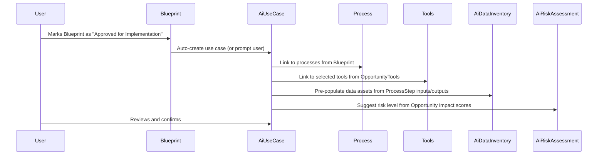

# AI Governance OS - System Architecture

**Version:** 1.0
**Last Updated:** 2025-01-29
**Status:** Phase 2 Design (Pre-Implementation)

---

## 1. Context and Alignment

### Building on Phase 1 Foundation

The AI Governance OS (Phase 2) is not a separate system—it's an **extension layer** built directly on top of the existing Better Than Interns platform (Phase 1).

**Phase 1 Provides:**
- **Projects**: Multi-tenant containers for automation initiatives
- **Processes & Steps**: Detailed workflow maps with owners, inputs, outputs
- **Opportunities**: AI/automation potential identified by LLM
- **Tools**: Catalog of AI vendors/services with metadata
- **Blueprints**: Implementation plans generated by LLM
- **Workspaces**: Org-level access control and data isolation

**Phase 2 Adds:**
- **AI Use Cases**: Governance layer wrapping implemented automations
- **Risk Assessments**: Structured risk evaluation per use case
- **Data Inventory**: What data flows through each AI system
- **Policy Mappings**: Which rules apply to which use cases
- **Reviews**: Periodic governance checkpoints
- **Governance Dashboard**: Overview and monitoring UI

### Key Architectural Principle

**One Source of Truth:**
- Phase 1 entities (Process, Tools, Blueprint) remain authoritative for **what** is being automated
- Phase 2 entities (AI Use Case, Risk, Policies) add **governance metadata** without duplicating operational data
- Changes in Phase 1 (e.g., tool selection) should trigger governance re-evaluation

**Relationship:**
```
Project (Phase 1)
  ├─ Process (Phase 1)
  │   ├─ ProcessSteps (Phase 1)
  │   └─ Opportunities (Phase 1)
  │       └─ OpportunityTools (Phase 1)
  │           └─ Tools (Phase 1)
  ├─ Blueprint (Phase 1)
  │
  └─ AI Use Case (Phase 2) ◄── Governance layer
      ├─ Links to: Process, Tools, Blueprint from Phase 1
      ├─ AI Risk Assessment (Phase 2)
      ├─ AI Data Inventory (Phase 2)
      ├─ AI Policy Mappings (Phase 2)
      └─ AI Reviews (Phase 2)
```

---

## 2. New Domain Objects (Conceptual)

### 2.1 AI Use Case

**Purpose:** Represents a concrete AI/automation implementation that requires governance oversight.

**Conceptual Schema:**
```typescript
type AiUseCase = {
  id: string;

  // Identity
  name: string; // "Customer Support Chatbot"
  description: string; // "AI-powered chatbot for handling customer FAQs"

  // Links to Phase 1
  projectId: string; // Parent project
  processIds: string[]; // Which processes does this automate (usually 1, can be N)
  opportunityIds: string[]; // Which opportunities does this address (usually 1-3)
  toolIds: string[]; // Which AI tools/vendors are used (from Phase 1 Tool catalog)
  blueprintId?: string; // Optional: which blueprint led to this implementation

  // Ownership & Organization
  ownerId: string; // User responsible for this AI use case
  department: string; // "Operations", "HR", "Finance", etc.

  // Lifecycle
  status: 'planned' | 'pilot' | 'production' | 'paused' | 'retired';
  plannedDate?: Date;
  pilotStartDate?: Date;
  productionDate?: Date;
  retiredDate?: Date;

  // Scope
  usersAffected: number; // Estimated users impacted
  volumeEstimate: string; // "500 transactions/day", "100 employees", etc.
  businessValue: string; // Expected benefit (from Opportunity or Blueprint)

  // Governance
  riskLevel?: 'low' | 'medium' | 'high' | 'critical'; // From risk assessment
  lastReviewDate?: Date;
  nextReviewDate?: Date;

  // Audit
  createdAt: Date;
  updatedAt: Date;
  createdBy: string;
};
```

**Key Behaviors:**
- Can be created manually or auto-generated from Blueprint
- Status transitions require validation (e.g., can't go to Production without risk assessment)
- Deleting underlying Process/Blueprint doesn't delete Use Case (governance record persists)

---

### 2.2 AI Risk Assessment

**Purpose:** Structured evaluation of risks associated with an AI use case.

**Conceptual Schema:**
```typescript
type AiRiskAssessment = {
  id: string;
  useCaseId: string; // FK to AiUseCase

  // Assessment metadata
  assessmentDate: Date;
  assessedBy: string; // User ID
  assessmentMethod: 'manual' | 'llm-assisted' | 'template';

  // Impact dimensions (scored 1-4: low/medium/high/critical)
  peopleImpact: number; // Who's affected, how many, vulnerable groups?
  dataImpact: number; // Sensitivity of data processed
  decisionImpact: number; // Criticality of automated decisions
  regulatoryImpact: number; // Regulatory compliance requirements
  safetyImpact: number; // Physical/financial safety concerns

  // Overall risk
  overallRiskLevel: 'low' | 'medium' | 'high' | 'critical';
  overallRiskScore: number; // 1-100 composite score

  // Risk details
  identifiedRisks: RiskDetail[]; // Array of specific risks
  mitigationNotes: string; // How risks are being addressed
  residualRisk: string; // Remaining risk after controls

  // LLM-generated content (if applicable)
  llmDraft?: string; // Original LLM-generated risk analysis
  llmConfidence?: number; // 0-1, how confident was the LLM
  userOverrides?: string[]; // What user changed from LLM draft

  // Review schedule
  nextReviewDate: Date; // Auto-calculated based on risk level
  reviewFrequency: 'weekly' | 'monthly' | 'quarterly' | 'annually';

  // Version control
  version: number; // Increment on each reassessment
  previousAssessmentId?: string; // Link to prior version

  createdAt: Date;
  updatedAt: Date;
};

type RiskDetail = {
  category: 'bias' | 'privacy' | 'security' | 'accuracy' | 'safety' | 'compliance' | 'other';
  description: string; // "Potential for demographic bias in loan approvals"
  likelihood: 'rare' | 'unlikely' | 'possible' | 'likely' | 'almost_certain';
  impact: 'negligible' | 'minor' | 'moderate' | 'major' | 'severe';
  mitigation: string; // "Regular bias audits, diverse training data"
};
```

**Key Behaviors:**
- One current assessment per use case (historical versions retained)
- Risk level change triggers notification to owner and governance lead
- High/Critical risk requires approval before Production status

---

### 2.3 AI Data Inventory

**Purpose:** Document what data is processed by the AI use case and how it flows through systems.

**Conceptual Schema:**
```typescript
type AiDataInventory = {
  id: string;
  useCaseId: string; // FK to AiUseCase

  // Data assets
  dataAssets: AiDataAsset[];

  // Data flows
  dataFlows: AiDataFlow[];

  // Summary flags
  processesPersonalData: boolean;
  processesSensitiveData: boolean;
  crossBorderTransfer: boolean;
  transferCountries?: string[]; // ["US", "EU", "UK"]

  // GDPR/Privacy
  legalBasis?: string; // "consent", "contract", "legitimate_interest", etc.
  dataSubjects?: string[]; // "customers", "employees", "partners"
  retentionPeriod?: string; // "7 years", "indefinite", etc.

  // Compliance
  dpiaRequired: boolean; // Data Protection Impact Assessment
  dpiaCompleted: boolean;
  dpiaDate?: Date;

  lastUpdated: Date;
  updatedBy: string;
};

type AiDataAsset = {
  name: string; // "Customer names and email addresses"
  dataType: string; // "PII", "Financial", "Health", "Biometric", "Aggregate"
  classification: 'public' | 'internal' | 'confidential' | 'restricted';
  volumeEstimate?: string; // "10K records", "500GB", etc.
  source: string; // Where does this data come from?
  purpose: string; // Why is this data needed?
};

type AiDataFlow = {
  sourceSystem: string; // "Salesforce CRM"
  destinationSystem: string; // "OpenAI API"
  viaSystem?: string; // "Zapier" (intermediary)
  dataTypes: string[]; // Which data assets flow through
  frequency: string; // "Real-time", "Daily batch", etc.
  encryption: boolean;
  accessControls: string; // Who can access
};
```

**Key Behaviors:**
- Auto-populated from Process step inputs/outputs and Selected Tools
- User can override/enhance auto-generated inventory
- Changes trigger re-evaluation if new sensitive data added

---

### 2.4 AI Policy & Control

**Purpose:** Define organizational rules for AI use and map them to specific use cases.

**Conceptual Schema:**
```typescript
type AiPolicy = {
  id: string;

  // Policy identity
  name: string; // "Customer Data Retention Policy"
  description: string; // Full policy text or summary
  policyUrl?: string; // Link to full policy doc
  category: 'data_governance' | 'risk_management' | 'compliance' | 'ethics' | 'security' | 'operational';

  // Applicability rules
  applicableWhen: PolicyApplicabilityRule[];
  requiredFor: 'all' | 'high_risk' | 'personal_data' | 'critical' | 'custom';

  // Required controls
  requiredControls: AiControl[];

  // Policy metadata
  owner: string; // Who maintains this policy
  version: string; // "1.2"
  effectiveDate: Date;
  lastReviewDate?: Date;
  status: 'draft' | 'active' | 'deprecated';

  createdAt: Date;
  updatedAt: Date;
};

type PolicyApplicabilityRule = {
  condition: string; // "riskLevel === 'high'"
  operator: 'equals' | 'greater_than' | 'contains' | 'custom';
  value: string;
};

type AiControl = {
  id: string;
  name: string; // "Human review of automated decisions"
  description: string; // What needs to happen
  controlType: 'technical' | 'process' | 'people';
  frequency: 'once' | 'periodic' | 'continuous';
  evidenceRequired: string; // "Logs", "Tickets", "Attestation", "Audit report"
  implementationGuide?: string; // How to implement this control
};

type AiPolicyMapping = {
  id: string;
  useCaseId: string; // FK
  policyId: string; // FK

  // Mapping details
  applicability: 'required' | 'recommended' | 'optional';
  reason: string; // Why this policy applies (auto-generated or manual)
  appliedDate: Date;
  appliedBy: string;

  // Control implementation
  controlStatuses: ControlStatus[];

  // Compliance
  compliant: boolean; // All required controls implemented?
  lastVerified?: Date;
  verifiedBy?: string;

  createdAt: Date;
  updatedAt: Date;
};

type ControlStatus = {
  controlId: string; // FK to AiControl
  status: 'not_started' | 'in_progress' | 'implemented' | 'verified';
  implementationDate?: Date;
  evidence?: string; // URL or description
  notes?: string;
  verifiedBy?: string;
  verifiedDate?: Date;
};
```

**Key Behaviors:**
- Policies are global (org-level, not per workspace)
- Auto-suggestion of policies based on risk assessment
- Control checklist drives compliance tracking
- Policy updates trigger re-evaluation of all affected use cases

---

### 2.5 AI Review

**Purpose:** Track periodic governance checkpoints to ensure AI use cases remain appropriate.

**Conceptual Schema:**
```typescript
type AiReview = {
  id: string;
  useCaseId: string; // FK

  // Review metadata
  reviewType: 'risk' | 'policy' | 'performance' | 'incident' | 'annual';
  scheduledDate: Date;
  completedDate?: Date;
  status: 'scheduled' | 'in_progress' | 'completed' | 'overdue';

  // Reviewer
  reviewerId: string; // User ID
  reviewerRole: string; // "Governance Lead", "Use Case Owner", "External Auditor"

  // Review content
  checklist: ReviewChecklistItem[];
  findings: string; // Free-text notes
  recommendations: string[]; // Action items

  // Review outcome
  outcome: 'continue' | 'modify' | 'pause' | 'retire' | 'escalate';
  riskLevelChange?: 'low' | 'medium' | 'high' | 'critical'; // If risk reassessed
  statusChange?: 'planned' | 'pilot' | 'production' | 'paused' | 'retired'; // If status changed

  // Next review
  nextReviewDate?: Date; // Auto-calculated or manually set

  // Audit trail
  createdAt: Date;
  updatedAt: Date;
};

type ReviewChecklistItem = {
  question: string; // "Has the use case scope changed since last review?"
  answer: 'yes' | 'no' | 'n/a';
  notes?: string;
  required: boolean;
};

type AiIncident = {
  id: string;
  useCaseId: string; // FK

  // Incident details
  incidentType: 'bias_detected' | 'data_breach' | 'system_failure' | 'policy_violation' | 'accuracy_issue' | 'safety_event' | 'other';
  severity: 'low' | 'medium' | 'high' | 'critical';
  description: string;

  // Timeline
  detectedDate: Date;
  reportedDate: Date;
  reportedBy: string;
  resolvedDate?: Date;

  // Root cause & remediation
  rootCause?: string;
  remediation?: string;
  preventiveMeasures?: string;

  // Impact
  usersAffected?: number;
  dataImpacted?: string;
  financialImpact?: string;
  reputationalImpact?: string;

  // Follow-up
  reviewRequired: boolean; // Trigger ad-hoc review?
  riskReassessmentNeeded: boolean;

  createdAt: Date;
  updatedAt: Date;
};
```

**Key Behaviors:**
- Reviews auto-scheduled based on risk level and last review date
- Overdue reviews trigger notifications
- Review completion updates nextReviewDate
- Incident logging can trigger out-of-band reviews

---

## 3. Relationships to Existing Phase 1 Objects

### 3.1 AI Use Case ↔ Phase 1 Entities

```
AiUseCase
  ├─ projectId → Project (1:1 or N:1)
  │   Purpose: Every use case belongs to a project (tenant isolation)
  │
  ├─ processIds → Process[] (1:N)
  │   Purpose: Use case automates one or more processes
  │   Example: "Invoice Processing" use case automates "Invoice Receipt" and "Invoice Approval" processes
  │
  ├─ opportunityIds → Opportunity[] (1:N)
  │   Purpose: Use case addresses specific opportunities identified in Phase 1
  │   Example: Use case might address "Opportunity #3: OCR for invoices" and "Opportunity #5: Auto-categorization"
  │
  ├─ toolIds → Tool[] (1:N)
  │   Purpose: Use case uses specific AI tools/vendors
  │   Example: ["OpenAI GPT-4", "Google Document AI", "Zapier"]
  │   Note: Filtered from OpportunityTools where userSelected = true
  │
  └─ blueprintId → Blueprint (1:1 optional)
      Purpose: Use case implements a specific blueprint
      Note: Not all use cases come from blueprints (some ad-hoc)
```

### 3.2 Data Flow from Phase 1 → Phase 2

**Scenario: Blueprint Approval → AI Use Case Creation**



**Auto-Population Logic:**

| AI Use Case Field | Auto-Populated From Phase 1 |
|-------------------|------------------------------|
| `name` | Blueprint.title or Project.name + Process.name |
| `description` | Blueprint.executiveSummary (first 500 chars) |
| `projectId` | Blueprint.projectId |
| `processIds` | All processes included in Blueprint |
| `opportunityIds` | All opportunities with userSelected tools |
| `toolIds` | All OpportunityTools where userSelected = true |
| `ownerId` | Project.owner or Process.owner |
| `department` | Inferred from Project.industry or manual input |
| `status` | Default: "planned" |

| AI Data Inventory Field | Auto-Populated From Phase 1 |
|-------------------------|------------------------------|
| `dataAssets` | ProcessStep.inputs + ProcessStep.outputs |
| `dataAssets[].classification` | Heuristic: "customer" → Confidential, "internal" → Internal |
| `dataFlows[].sourceSystem` | ProcessStep descriptions |
| `dataFlows[].destinationSystem` | Tool.name from selected tools |
| `processesPersonalData` | Keyword detection: "customer", "employee", "email", "name" in data assets |

| AI Risk Assessment Field | Auto-Populated From Phase 1 |
|--------------------------|------------------------------|
| `peopleImpact` | Opportunity.impactScore / 25 (maps 0-100 to 1-4) |
| `dataImpact` | Inferred from data classification |
| `overallRiskLevel` | Heuristic based on impact score and data sensitivity |
| `llmDraft` | LLM call with context from Process, Tools, Opportunities |

---

### 3.3 Governance Triggers from Phase 1 Changes

**Scenario: User changes selected tools for an Opportunity**

```
1. User unchecks "Tool A" and checks "Tool B" in Tool Recommendations dialog
2. OpportunityTool.userSelected updated in database
3. If AiUseCase exists linked to this Opportunity:
   a. Trigger notification: "Tool change detected, review needed"
   b. Update AiUseCase.toolIds to reflect new selection
   c. Flag AiDataInventory for review (new vendor = new data flow)
   d. Flag AiRiskAssessment for review (vendor risk may change)
   e. Auto-schedule ad-hoc governance review
```

**Scenario: Process steps are modified after AI Use Case is in Production**

```
1. User adds new ProcessStep or modifies inputs/outputs
2. If AiUseCase exists linked to this Process:
   a. Trigger notification: "Process change detected"
   b. Option 1: Auto-update AiDataInventory with new data assets
   c. Option 2: Flag for manual review (safer for Production systems)
   d. Log change in audit trail
```

**Principle:** Phase 1 is source of truth, but changes should trigger governance re-evaluation, not auto-apply.

---

## 4. Views / Screens (Conceptual)

### 4.1 Governance Home (Dashboard)

**URL:** `/governance`

**Purpose:** Central hub for governance leads to see overview and access all features.

**Layout:**

```
┌─────────────────────────────────────────────────────────────┐
│  Governance Dashboard                    [Create Use Case]  │
├─────────────────────────────────────────────────────────────┤
│                                                              │
│  📊 Summary Stats                                            │
│  ┌────────────┬────────────┬────────────┬────────────┐      │
│  │ Total Use  │ Production │ High Risk  │ Reviews    │      │
│  │ Cases      │ Systems    │ Systems    │ Due        │      │
│  │    47      │     23     │      8     │      5     │      │
│  └────────────┴────────────┴────────────┴────────────┘      │
│                                                              │
│  📈 Risk Distribution                                        │
│  [Pie Chart: Low 25, Medium 14, High 7, Critical 1]         │
│                                                              │
│  📋 Use Case List                                            │
│  Filters: [Status ▼] [Risk ▼] [Department ▼] [Search...]    │
│  ┌────────────────────────────────────────────────────────┐ │
│  │ Name               │Dept  │Status│Risk  │Review│Owner │ │
│  ├────────────────────────────────────────────────────────┤ │
│  │ Invoice OCR        │Fin   │Prod  │Med 🟡│2mo  │Alex  │ │
│  │ Resume Screening   │HR    │Pilot │High🔴│1mo  │Jamie │ │
│  │ Customer Chatbot   │Ops   │Prod  │Med 🟡│3mo  │Sam   │ │
│  │ ...                                                    │ │
│  └────────────────────────────────────────────────────────┘ │
│  [Load More]                              [Export CSV]      │
│                                                              │
│  ⚠️ Attention Needed                                         │
│  • 5 reviews overdue                                        │
│  • 2 use cases missing risk assessments                    │
│  • 1 policy update affects 8 use cases                     │
│                                                              │
└─────────────────────────────────────────────────────────────┘
```

**Key Features:**
- Quick stats at top
- Visual risk distribution
- Filterable/sortable use case table
- Attention widgets for actionable items
- One-click export to CSV

---

### 4.2 Use Case Detail

**URL:** `/governance/use-cases/[id]`

**Purpose:** Comprehensive view of a single AI use case with all governance metadata.

**Layout:**

```
┌─────────────────────────────────────────────────────────────┐
│  ← Back to Dashboard                          [Edit] [More▼]│
├─────────────────────────────────────────────────────────────┤
│  Customer Support Chatbot                        🟡 Medium  │
│  Operations Department • Production • Owner: Sam Chen       │
│                                                              │
│  Tabs: [Overview] [Risk] [Data & Systems] [Policies]        │
│        [Reviews] [Audit Log]                                │
│                                                              │
│  ─── OVERVIEW ───────────────────────────────────────────── │
│                                                              │
│  📄 Description                                              │
│  AI-powered chatbot handling customer FAQs, integrated      │
│  with Zendesk. Reduces support ticket volume by 30%.        │
│                                                              │
│  🔗 Linked Entities (from Phase 1)                           │
│  Project: Acme Corp Automation                              │
│  Processes:                                                  │
│    • Customer Support Process (view)                        │
│  Opportunities:                                              │
│    • Automate FAQ responses (#12, Impact: 75/100)           │
│  Tools:                                                      │
│    • OpenAI GPT-4 (LLM)                                     │
│    • Zendesk (Integration)                                  │
│  Blueprint: Customer Service Automation v1 (view)           │
│                                                              │
│  📊 Metrics                                                  │
│  Users Affected: ~10,000 customers/month                    │
│  Volume: 500 conversations/day                              │
│  Business Value: $50K/year support cost savings             │
│                                                              │
│  📅 Timeline                                                 │
│  Planned: 2024-Q4                                           │
│  Pilot: Jan 2025 - Feb 2025                                 │
│  Production: Mar 1, 2025                                    │
│  Last Review: 1 month ago                                   │
│  Next Review: May 1, 2025 (in 2 months)                     │
│                                                              │
│  ─── RISK TAB ──────────────────────────────────────────── │
│  (See Risk Assessment schema visualization)                 │
│                                                              │
│  ─── DATA & SYSTEMS TAB ────────────────────────────────── │
│  (See Data Inventory schema visualization)                  │
│                                                              │
│  ─── POLICIES TAB ──────────────────────────────────────── │
│  (See Policy Mapping schema visualization)                  │
│                                                              │
└─────────────────────────────────────────────────────────────┘
```

**Key Features:**
- Tabbed interface for different aspects
- Clear links back to Phase 1 entities (with ability to jump to them)
- Visual timeline of lifecycle
- At-a-glance risk badge

---

### 4.3 Risk Overview

**URL:** `/governance/risk`

**Purpose:** Filter and analyze AI use cases by risk dimensions.

**Layout:**

```
┌─────────────────────────────────────────────────────────────┐
│  Risk Overview                                               │
├─────────────────────────────────────────────────────────────┤
│                                                              │
│  Filters:                                                    │
│  [All Risk Levels ▼] [All Departments ▼]                    │
│  [Personal Data? ▼] [Data Sensitivity ▼]                    │
│                                                              │
│  📊 Risk Heatmap                                             │
│  ┌────────────────────────────────────────────┐             │
│  │           Likelihood →                     │             │
│  │ I   ┌─────┬─────┬─────┬─────┬─────┐       │             │
│  │ m   │  L  │  L  │  M  │  M  │  H  │       │             │
│  │ p   ├─────┼─────┼─────┼─────┼─────┤       │             │
│  │ a   │  L  │  M  │  M  │  H  │  H  │       │             │
│  │ c   ├─────┼─────┼─────┼─────┼─────┤       │             │
│  │ t   │  M  │  M  │  H  │  H  │  C  │       │             │
│  │ ↓   ├─────┼─────┼─────┼─────┼─────┤       │             │
│  │     │  M  │  H  │  H  │  C  │  C  │       │             │
│  │     ├─────┼─────┼─────┼─────┼─────┤       │             │
│  │     │  H  │  H  │  C  │  C  │  C  │       │             │
│  │     └─────┴─────┴─────┴─────┴─────┘       │             │
│  │     [12 use cases plotted on matrix]      │             │
│  └────────────────────────────────────────────┘             │
│                                                              │
│  🔴 Critical Risk (1)                                        │
│  • Medical Diagnosis Assistance                             │
│                                                              │
│  🟠 High Risk (7)                                            │
│  • Resume Screening AI                                      │
│  • Credit Scoring Model                                     │
│  • ...                                                       │
│                                                              │
│  🟡 Medium Risk (14)                                         │
│  🟢 Low Risk (25)                                            │
│  [View All]                                                  │
│                                                              │
└─────────────────────────────────────────────────────────────┘
```

**Key Features:**
- Visual risk matrix
- Drill-down by risk category
- Export risk report for board/regulators

---

### 4.4 Review Calendar

**URL:** `/governance/reviews`

**Purpose:** See upcoming reviews and complete them.

**Layout:**

```
┌─────────────────────────────────────────────────────────────┐
│  Review Calendar                                             │
├─────────────────────────────────────────────────────────────┤
│                                                              │
│  📅 Upcoming Reviews (Next 30 Days)                          │
│  ┌────────────────────────────────────────────────────────┐ │
│  │ Due Date  │ Use Case           │ Type     │ Owner      │ │
│  ├────────────────────────────────────────────────────────┤ │
│  │ Mar 15    │ Invoice OCR        │ Risk     │ Alex K     │ │
│  │ Mar 18    │ Customer Chatbot   │ Policy   │ Sam C      │ │
│  │ Mar 22    │ Resume Screening   │ Risk     │ Jamie L    │ │
│  │ ...                                                    │ │
│  └────────────────────────────────────────────────────────┘ │
│                                                              │
│  ⚠️ Overdue (5)                                              │
│  • Email Categorization (7 days overdue)                    │
│  • ...                                                       │
│                                                              │
│  📊 Review Completion Rate: 87%                              │
│  (Last 90 days: 52/60 reviews completed on time)            │
│                                                              │
└─────────────────────────────────────────────────────────────┘
```

---

## 5. AI Assistance Role

### Where LLMs Help (Automation)

**1. Risk Assessment Drafting**
- **Input:** Process description, Tools used, Data types, Industry
- **Output:** Draft risk assessment with:
  - Suggested risk level (Low/Med/High/Critical)
  - Identified risk categories (bias, privacy, security, etc.)
  - Risk descriptions and potential impacts
  - Suggested mitigations
- **User Role:** Review, adjust, approve
- **Confidence:** Medium (70-80% accuracy expected, requires human validation)

**2. Policy Recommendation**
- **Input:** Risk assessment, Data inventory, Industry
- **Output:** Suggested policies that should apply
  - "GDPR Compliance" (if personal data + EU)
  - "Human-in-the-Loop Review" (if high-risk decisions)
  - "Bias Testing Program" (if hiring/lending/high-stakes)
- **User Role:** Select applicable policies, can override
- **Confidence:** High (90%+ accuracy on rule-based logic)

**3. Data Asset Identification**
- **Input:** Process step inputs/outputs, Tool descriptions
- **Output:** List of data types likely processed
  - "Customer names and email addresses (PII)"
  - "Financial transaction data"
  - "Product usage analytics"
- **User Role:** Confirm, add missing, adjust classifications
- **Confidence:** Medium (75-85%, keyword-based with LLM enhancement)

**4. Control Checklist Generation**
- **Input:** Risk level, Policies applied, Industry standards
- **Output:** Checklist of recommended controls
  - Technical: "Implement access logging"
  - Process: "Quarterly bias audit"
  - People: "Train reviewers on policy"
- **User Role:** Select controls to implement, mark as complete
- **Confidence:** High (controls are templated, LLM assists with prioritization)

**5. Review Question Customization**
- **Input:** Use case type, Risk level, Last review notes
- **Output:** Tailored review checklist
  - Generic questions for all use cases
  - Risk-specific questions for high-risk
  - Follow-up questions on prior incidents
- **User Role:** Answer questions, add notes
- **Confidence:** Medium (questions are templated, LLM reorders/emphasizes)

---

### Where Humans MUST Be in Control (Guardrails)

**1. Final Risk Level Decision**
- LLM can suggest, but human must approve
- High/Critical risk requires governance lead sign-off
- Rationale: Risk tolerance varies by org, LLM can't know context

**2. Policy Acceptance**
- LLM suggests policies, but human decides if applicable
- Override must be justified (free-text field)
- Rationale: Policies have legal implications

**3. Production Approval**
- High/Critical risk use cases require human approval before Production status
- Cannot be auto-approved by LLM
- Rationale: Deployment decisions have business impact

**4. Incident Classification**
- LLM can detect potential incidents (anomalies), but human classifies severity
- Rationale: Severity has regulatory/PR implications

**5. Data Classification**
- LLM suggests, but human confirms (especially for "Confidential" or "Restricted")
- Rationale: Data breaches are costly, need human verification

**6. Control Implementation Sign-Off**
- LLM can't mark controls as "Implemented" or "Verified"
- Must be done by use case owner or auditor
- Rationale: Compliance attestation is legal commitment

---

### LLM Error Handling in Governance

**Principle:** Governance is too important to fail silently. LLM failures should degrade gracefully.

**Strategy:**

| LLM Task | Fallback on Failure |
|----------|---------------------|
| Risk assessment draft | Show blank form, user fills manually |
| Policy recommendation | Show all policies, user selects |
| Data asset identification | Show template list, user checks applicable |
| Control checklist | Show default checklist for risk level |
| Review questions | Show generic review template |

**User Communication:**
- If LLM fails: "AI assist unavailable, please complete manually"
- Never block user from proceeding
- Log LLM failures for debugging (use logging.ts infrastructure from Phase 1.5)

---

## 6. Future Implementation Notes

### 6.1 Notification System

**Not in MVP, but design for:**

**Triggers:**
- Review due in 7 days
- Review overdue
- Risk level changed to High/Critical
- Policy updated (affects N use cases)
- Incident logged
- Phase 1 change detected (tool selection changed, process modified)

**Channels:**
- Email (primary)
- In-app notification bell (secondary)
- Webhook (for integrations)

**Preferences:**
- User can set frequency: Real-time, Daily digest, Weekly digest
- User can mute specific notification types
- Governance lead can override (force-send critical notifications)

---

### 6.2 External System Integrations

**GRC Tools (Governance, Risk, Compliance):**
- Export AI inventory to tools like: OneTrust, ServiceNow GRC, LogicGate
- Sync via REST API or CSV export
- Use case: Customer uses Better Than Interns for AI discovery, exports to existing GRC system for broader risk management

**Audit & Compliance:**
- Read-only access for external auditors
- Export evidence packages (use case + risk assessment + policies + reviews)
- Audit trail (all changes logged with user, timestamp, before/after)

**Ticketing Systems:**
- Create Jira/Linear/Asana tickets for:
  - Control implementation tasks
  - Review reminders
  - Incident remediation
- Bi-directional sync: Ticket closed → mark control as Implemented

**BI/Reporting Tools:**
- Export governance metrics to Tableau/PowerBI/Looker
- Metrics: Risk distribution, review completion rate, incident trends
- Use case: Executive dashboard showing AI governance KPIs

---

### 6.3 Audit Logs

**What to Log:**
- Use case created/modified/deleted (who, when, what changed)
- Risk assessment created/updated (old risk level → new risk level)
- Policy applied/removed
- Control marked as implemented/verified
- Review completed
- Incident logged/resolved
- Status transitions (Planned → Pilot → Production)
- Data inventory updated
- LLM assists (what was suggested, what user kept/changed)

**Storage:**
- Append-only log table
- Retention: 7 years (regulatory compliance)
- Queryable by: use case, user, date range, action type

**Access:**
- Governance leads: Full access
- Use case owners: Their use cases only
- Auditors: Read-only, all logs

**Use Cases:**
- "Who approved this high-risk use case for Production?"
- "When was the risk level last changed?"
- "What changes were made to this use case in the last 6 months?"
- "Show all actions by User X"

---

### 6.4 Multi-Workspace Governance

**Challenge:** Org has multiple workspaces (departments, subsidiaries), needs org-wide governance view.

**Approach:**
- **Option 1:** Super-workspace (parent workspace sees child workspaces)
- **Option 2:** Cross-workspace query (governance lead has access to multiple workspaces)
- **Option 3:** Consolidated reporting (read-only aggregate view)

**Design Decision:** Defer to user feedback. Start with workspace isolation (Phase 2 MVP), add cross-workspace in later phase if needed.

---

### 6.5 Public Transparency

**Use Case:** Org wants to publish AI use case registry to customers/public (trust-building).

**Features:**
- Public-facing page: "Our AI Systems"
- For each use case (that org chooses to publish):
  - Name, description, purpose
  - Data types processed (high-level)
  - Risk level
  - Controls in place
  - How to appeal decisions (if applicable)
- Exclude: Internal details, specific vendors, exact data volumes

**Privacy Considerations:**
- Opt-in per use case (default: private)
- Redact sensitive info
- Legal review before publishing

**Examples:**
- LinkedIn's "Fairness in AI" page
- Airbnb's "How Our Search Ranking Works"

---

## 7. Data Model Impact (High-Level)

**Note:** This is conceptual. Actual schema implementation happens in future milestones.

### New Tables (Estimated)

1. **ai_use_cases**
   - ~15 columns
   - Foreign keys: projectId, ownerId
   - Indexes: status, riskLevel, department

2. **ai_risk_assessments**
   - ~12 columns
   - JSON field for identifiedRisks array
   - Foreign key: useCaseId

3. **ai_data_inventories**
   - ~8 columns
   - JSON fields for dataAssets[], dataFlows[]
   - Foreign key: useCaseId

4. **ai_policies**
   - ~10 columns
   - Org-level (no workspace FK in MVP, revisit later)

5. **ai_policy_mappings**
   - ~8 columns
   - JSON field for controlStatuses[]
   - Foreign keys: useCaseId, policyId

6. **ai_reviews**
   - ~12 columns
   - JSON field for checklist[]
   - Foreign keys: useCaseId, reviewerId

7. **ai_incidents**
   - ~15 columns
   - Foreign key: useCaseId

8. **ai_controls** (if not embedded in policies)
   - ~8 columns
   - Foreign key: policyId

### Estimated Storage

- 100 use cases × 7 tables × ~500 bytes/row = ~350 KB (negligible)
- JSON fields can grow (risk details, data flows), but still < 10 KB per use case
- **Conclusion:** Governance data adds minimal storage overhead

### Query Patterns

**Common Queries:**
1. Get all use cases with risk = High (indexed on riskLevel)
2. Get use cases due for review (indexed on nextReviewDate)
3. Get use cases using Tool X (join via toolIds array or junction table)
4. Get use cases with incomplete risk assessments (LEFT JOIN check)
5. Get governance overview for dashboard (aggregates)

**Performance Considerations:**
- Most queries are small (< 100 use cases returned)
- Heavy queries (exports, reports) can be async
- Cache dashboard stats (refresh every 5 minutes)

---

## 8. Migration Strategy (Phase 1 → Phase 2)

### Approach: Additive, Non-Breaking

**Principles:**
1. Phase 2 tables are NEW, don't modify Phase 1 tables
2. Phase 1 code continues to work unchanged
3. Governance features are opt-in (navigate to /governance to use)
4. Gradual adoption (can have Blueprints without Use Cases)

### Migration Steps

**Step 1: Schema Extension**
- Add new tables (ai_use_cases, etc.) via Prisma migration
- No foreign key from Phase 1 tables to Phase 2 (keep loose coupling)
- Phase 2 tables reference Phase 1 via IDs (e.g., useCaseId → processId)

**Step 2: Seed Policies**
- Pre-populate ai_policies table with common templates (GDPR, HIPAA, etc.)
- Allows users to immediately map policies without creating them

**Step 3: Opt-In Use Case Creation**
- Add "Create Governance Entry" button to Blueprint view (Phase 1 UI)
- Modal prompts user to create AI Use Case
- Pre-fills from Blueprint data
- User confirms → creates row in ai_use_cases table

**Step 4: Dashboard Launch**
- New route: /governance
- Accessible from main nav (for users with governance role)
- Lists all AI use cases (even if created from old Blueprints)

**Step 5: Gradual Feature Rollout**
- Week 1: Use case registry + risk assessment
- Week 2: Data inventory
- Week 3: Policy mapping
- Week 4: Reviews

**Rollback Plan:**
- If Phase 2 has critical bugs, can hide /governance route
- Phase 1 functionality unaffected
- Fix bugs, re-enable governance features

---

## 9. Technology Choices (Consistent with Phase 1)

**No new tech stack.** Governance uses same tools as Phase 1:

- **Frontend:** Next.js 14, React, TypeScript, Shadcn/ui, Tailwind CSS
- **Backend:** Next.js API routes, Prisma ORM
- **Database:** PostgreSQL (Supabase)
- **Auth:** NextAuth (workspace-based access control)
- **LLM:** OpenAI GPT-4 (for risk drafting, policy suggestions)
- **Deployment:** Vercel

**New Libraries (Minor):**
- `react-calendar` or similar (for review calendar view) - TBD
- `recharts` or `chart.js` (for risk heatmap, pie charts) - TBD

---

## 10. Open Questions

1. **Use Case Granularity:** Can one Blueprint spawn multiple Use Cases?
   - Example: "Marketing Automation" blueprint covers email AI, chatbot AI, content generation AI
   - Should these be 3 separate use cases or 1?
   - **Recommendation:** User choice. Provide "Split into multiple use cases" option.

2. **Historical Blueprints:** Should we backfill Use Cases for Blueprints created before Phase 2?
   - **Recommendation:** Provide bulk import tool (CSV upload or guided wizard).

3. **Policy Versioning:** When a policy is updated, how to handle existing mappings?
   - **Recommendation:** Notify affected use case owners, require re-confirmation.

4. **Incident Severity Automation:** Should LLM auto-classify incidents?
   - **Recommendation:** LLM suggests, human confirms (too important to automate fully).

5. **Workspace vs. Org Policies:** Are policies workspace-specific or org-wide?
   - **Recommendation:** Start with org-wide (simpler), add workspace-specific in Phase 3 if needed.

6. **Review Delegation:** Can use case owner delegate review to someone else?
   - **Recommendation:** Yes, add "Assign Reviewer" button in review workflow.

7. **Bulk Actions:** Can governance lead bulk-update use cases (e.g., mark 10 as "Paused")?
   - **Recommendation:** Yes, add checkbox selection + bulk actions dropdown in MVP.

8. **Export Formats:** CSV only, or also PDF/Word for reports?
   - **Recommendation:** CSV for MVP, PDF in Phase 3 (requires additional libraries).

---

**End of Document**
